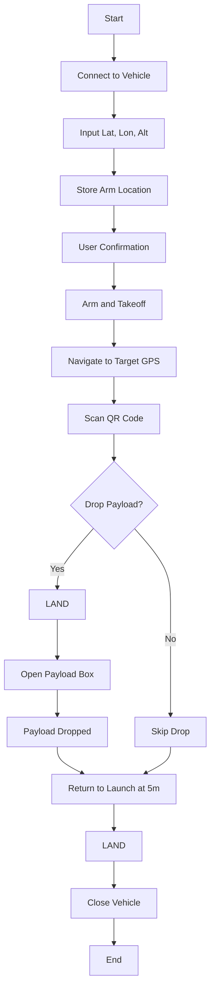

# Autonomous Quadcopter missions using Dronekit
# NOTE: This repo was deprecated in favour of a more reliable and hardware tested ROS2 implementation. Check it out here: https://github.com/jessmathews/ros2_autonomous_drone
## This Repo Contains:
- Testing Scripts for Dronekit (takeoff, hover, servo_control)
- Camera initialization scripts
- Streaming camera feed to webpage
- Mission Script
## Prerequisites
- Python3
- A stable calibrated Quadcopter with camera and GPS
## Mission Code Workflow



## Setup 
Clone the repo 
```sh
git clone https://github.com/jessmathews/mavcode
cd mavcode
```
NOTE: Create a virtual environment for easy dependency management.
```sh
python3 -m venv env
source env/bin/activate
```
Install requirements
```sh
pip install -r requirements.txt
pip install -r dronekit_control/requirements.txt
```
Run the code
```sh
cd dronekit_control
python3 main.py
```
### Created with ❤️ and Python
